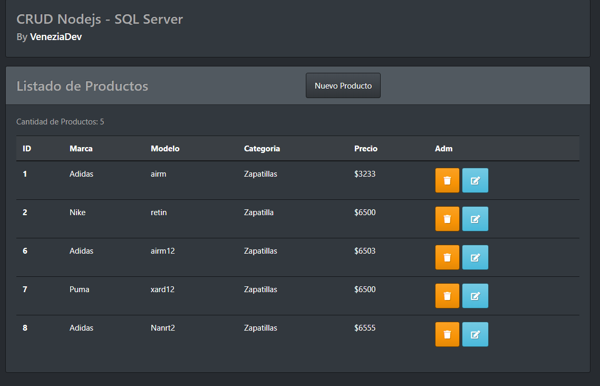

# nodejs-SQLserver-CRUD

(EN)
Example NODEJS - SQLSERVER 2012 - CRUD

Set the data of your SQL SERVER in "database/db.js"

Run: npm run dev

(ES)
Ejemplo CRUD con NODEJS, SQL SERVER 2012

Configurar la informacion de tu conexión con SQL SERVER en "database/db.js"

Despues ejecutar con: npm run dev

